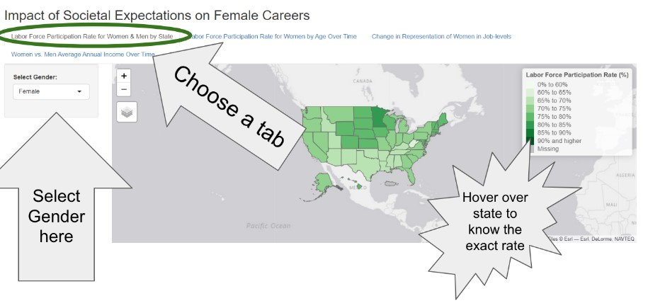
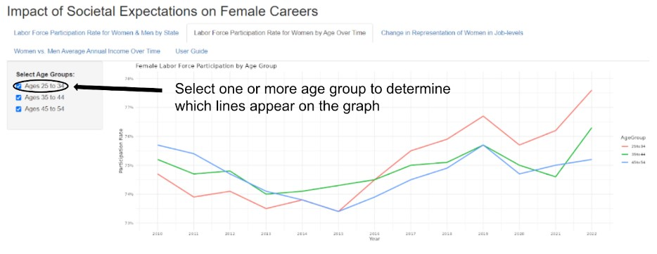
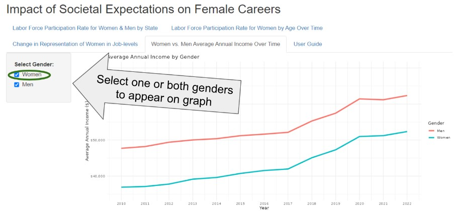

# Dashboard User Guide

## Our Research Question

How do societal expectations around gender roles like caregiving and household responsibilities impact women’s career choices and limit their opportunities in the United States, particularly in their late 20s to early 50s?

## Data Sources
- Labor Force Participation Rate for Women & Men by State Data Source: ["US Labor Force Participation by State"](https://www.dol.gov/agencies/wb/data/labor-force-participation-rate-by-sex)

- Labor Force Participation Rate for Women by Age Over Time Data Sources:
["US Bureau of Labor Statistics"](https://www.bls.gov/opub/ted/2023/labor-force-participation-rate-for-women-highest-in-the-district-of-columbia-in-2022.htm#:~:text=For%20the%20nation%20as%20a,was%2056.8%20percent%20in%202022.)
["US Department of Labor""](https://www.dol.gov/agencies/wb/data/lfp/women-by-age?utm_source=chatgpt.com)

- Change in Representation of Women in Job-levels Data Source: 
["McKinsey & Company pg. 5"](https://www.flipsnack.com/78C9ACFF8D6/women-in-the-workplace-2024/full-view.html) 

- Women vs. Men Average Annual Income Over Time Data Source: 
["US Census Bureau"](https://www.qualtrics.com/blog/timeline-gender-pay-gap/)

## How To Use This Dashboard

## Our Findings

Labor Force Participation Rate for Women and Men per State:

We found that there was a sizable difference between the labor force participation rate for men and women. Most states had a male participation rate in the range of 80% to 85%, while the most frequent labor force participation rate for women was about 70% to 75%. This difference remained consistent across states, with men participating in the labor force at a rate of about 10% higher than women do. This disparity is likely influenced by gender stereotypes, with women often assuming primary responsibility for childcare and household tasks such as cooking and cleaning. 

Labor Force Participation Rate for Women by Age over Time:

We found that from 2015 there has been a progressive upward trend in the labor force participation rate for females in all the age groups we looked at, except in 2019 there was a slight dip most likely due to the pandemic. This increase is likely due to women being more accepted into the workplace. It was interesting that initially the age category 25 to 34 in earlier years had the lowest participation rate out of the three age categories we looked at, but in later years the age category 25 to 34 has the highest labor force participation rate in comparison to the other age categories. This could be due to society encouraging young women to pursue their career aspirations instead of being a stay at home caretaker.

Change in Representation of Women in Varying Job Levels:

We found that higher level jobs are least commonly held by women, and even less commonly held by women of color. Women are much more likely to hold entry level jobs that have lower salaries and benefits than to reach positions such as Vice President or C-Suite Executive. 
This has consistently stayed true from the year 2017 to 2024. Despite the trend not changing, the overall percent of women in each job level category increased from 2017 to 2024. This may be due to the fact that companies are working towards lessening these disparities by making a more fair and equitable workplace. 

Average Annual Income of Women and Men over Time:

The trends of average annual income for both men and women over time were practically identical, with the average annual income for both men and women changing at the same rate. However, a persistent gap remains between the two income levels, with men consistently earning $10,000 more than women, on average. This reflects the gender pay gap in the United States, which is largely rooted in gender biases and stereotypes. Women are often steered toward lower-paying occupations and encounter barriers in their career paths due to the societal expectations of care-giving. As a result, women are not always seen as an integral part of the workforce in comparison to their male counterparts because it is assumed that their careers will take a backseat position in their lives when they eventually raise a family. 

## About

### Project team

Jordan Whitehouse (Project Coordinator) - Managed team and arranged meetings to work on the project. Scheduled meetings with the professor, as well as managed the code for visualizations. 
Sophie Van Rhijn (Designer) - Designed layout of Shiny App and determined how to make each visualization interactive. 
Izzie Huff (QA Engineer) - Consulted ChatGPT to fix code and design Shiny App, as well as recorded all conversations held with the AI.

### Acknowledgments
## Conversations With ChatGPT
1) Sneaky Squirrels:
“Write an r shiny code that when you hover over a state it shows you the female participation rate if you select "female" and male participation rate if you select "male".”

ChatGPT:
library(shiny)
library(tmap)
library(sf)
library(tidycensus)
library(dplyr)
library(readxl)
library(ggplot2)
library(gridExtra)

lfprfw_state <- read_excel("Labor_force_participation_rate_wm.xlsx")

us <- suppressMessages(
  get_acs(
    geography = "state",
    variables = "B02001_001",
    year = 2022,
    geometry = TRUE
  )
)

shift_geometries <- function(data_sf) {
  al <- data_sf[data_sf$NAME == "Alaska", ]
  hi <- data_sf[data_sf$NAME == "Hawaii", ]
  
  al <- st_set_crs(al, 4269)
  hi <- st_set_crs(hi, 4269)
  
  al <- st_transform(al, crs = 2163)
  hi <- st_transform(hi, crs = 2163)
  
  st_geometry(al) <- st_geometry(al) + c(2600000, -2000000)
  st_geometry(hi) <- st_geometry(hi) + c(5200000, -1400000)
  
  al <- st_transform(al, crs = st_crs(data_sf))
  hi <- st_transform(hi, crs = st_crs(data_sf))
  
  data_sf <- data_sf[data_sf$NAME != "Alaska" & data_sf$NAME != "Hawaii", ]
  data_sf <- rbind(data_sf, al, hi)
  
  return(data_sf)
}

merged_us_lfprfw_state_data <- us %>%
  left_join(
    lfprfw_state,
    by = c("NAME" = "State")
  ) %>%
  select(
    NAME,
    Female_Participation,
    Male_Participation,
    geometry
  ) %>%
  shift_geometries()

ui <- fluidPage(
  titlePanel("Labor Force Participation Rate by State"),
  tabsetPanel(
    tabPanel("Map",
      sidebarLayout(
        sidebarPanel(
          selectInput("gender", "Select Gender:",
                      choices = c("Female" = "Female_Participation", "Male" = "Male_Participation")),
          width = 2
        ),
        mainPanel(
          tmapOutput("map"),
          width = 10
        )
      )
    ),
    tabPanel("Age Groups",
      sidebarLayout(
        sidebarPanel(
          checkboxGroupInput("ages", "Select Age Groups:",
                             choices = c("25 to 34" = "25to34", 
                                         "35 to 44" = "35to44", 
                                         "45 to 54" = "45to54")),
          width = 2
        ),
        mainPanel(
          plotOutput("linePlot"),
          width = 10
        )
      )
    ),
    tabPanel("Job Levels",
      sidebarLayout(
        sidebarPanel(
          checkboxGroupInput("year", "Select Year:",
                      choices = c("2017", "2024")),
          checkboxGroupInput("race", "Select Race:",
                      choices = c("White", "Color", "Overall")),
          width = 2
        ),
        mainPanel(
          plotOutput("jobLevelPlot"),
          width = 10
        )
      )
    ),
    tabPanel("Women vs. Men Average Income",
      sidebarLayout(
        sidebarPanel(
          checkboxGroupInput("gender_income", "Select Gender:",
                             choices = c("Women" = "Women", "Men" = "Men")),
          width = 2
        ),
        mainPanel(
          plotOutput("incomePlot"),
          width = 10
        )
      )
    ),
    tabPanel("User Guide",
      sidebarLayout(
        sidebarPanel(
          width = 2
        ),
        mainPanel(
          h3("User Guide"),
          width = 10
        )
      )
    )
  )
)

server <- function(input, output) {
  output$map <- renderTmap({
    tmap_mode("plot")
    tm_shape(merged_us_lfprfw_state_data) +
      tm_polygons(
        col = input$gender,
        palette = "Greens",
        breaks = c(0, 60, 65, 70, 75, 80, 85, 90, 100),
        labels = c("0% to 60%", "60% to 65%", "65% to 70%", "70% to 75%", "75% to 80%", "80% to 85%", "85% to 90%", "90% and higher"),
        title = "Labor Force Participation Rate (%)",
        id = "NAME",
        popup.vars = c("Participation Rate" = input$gender)
      ) +
      tm_layout(
        main.title = paste("Labor Force Participation Rate by State for", ifelse(input$gender == "Female_Participation", "Women", "Men"), "(2022)"),
        main.title.position = c("center", "top"),
        legend.outside = TRUE,
        legend.outside.position = "right",
        frame = FALSE
      )
  })

  output$linePlot <- renderPlot({
    selected_ages <- input$ages
    if (length(selected_ages) == 0) return(NULL)  # If no age group is selected, show nothing
    
    plot_data <- female_participation %>%
      select(Year, all_of(selected_ages)) %>%
      pivot_longer(cols = all_of(selected_ages), names_to = "AgeGroup", values_to = "ParticipationRate")
    
    ggplot(plot_data, aes(x = Year, y = ParticipationRate, color = AgeGroup)) +
      geom_line(size = 1) +
      labs(
        title = "Female Labor Force Participation by Age Group",
        x = "Year",
        y = "Participation Rate"
      ) +
      scale_x_continuous(
        breaks = seq(min(female_participation$Year), max(female_participation$Year), by = 1),
        labels = as.integer
      ) +
      scale_y_continuous(
        labels = scales::percent_format(scale = 1),
        limits = c(73, 78)
      ) +
      theme_minimal()
  })

  output$jobLevelPlot <- renderPlot({
    selected_years <- input$year
    selected_races <- input$race
    if (length(selected_years) == 0 | length(selected_races) == 0) return(NULL)  # If no year or race is selected, show nothing
    
    plots <- lapply(selected_years, function(year) {
      data_selected <- if (year == "2017") new_2017 else new_2024
      data_selected <- data_selected %>% filter(Race %in% selected_races)
      
      ggplot(data_selected, aes(x = Position, y = Percent, fill = Race)) +
        geom_col(position = "dodge") +
        labs(
          title = paste("Changes in Representation in Job Levels (", year, ")", sep = ""),
          x = "Job Position",
          y = "Percent"
        ) +
        scale_y_continuous(labels = scales::percent_format(scale = 1)) +
        theme_minimal()
    })
    
    do.call(gridExtra::grid.arrange, c(plots, ncol = 1))
  })

  output$incomePlot <- renderPlot({
    selected_genders <- input$gender_income
    if (length(selected_genders) == 0) return(NULL)  # If no gender is selected, show nothing
    
    plot_data <- w_m_income %>%
      pivot_longer(cols = selected_genders, names_to = "Gender", values_to = "Income") %>%
      select(Year, Gender, Income)
    
    ggplot(plot_data

2) Sneaky Squirrels:
“Write a r shiny code that when you click on boxes age 25 to 34, age 35 to 44, and age 45 to 54 the line graph will appear on the graph”

ChatGPT:

library(shiny)
library(ggplot2)
library(dplyr)

ui <- fluidPage(
  titlePanel("Female Labor Force Participation"),
  sidebarLayout(
    sidebarPanel(
      checkboxGroupInput("ages", "Select Age Groups:",
                         choices = c("25 to 34" = "25to34",
                                     "35 to 44" = "35to44",
                                     "45 to 54" = "45to54")),
      width = 2
    ),
    mainPanel(
      plotOutput("linePlot"),
      width = 10
    )
  )
)

server <- function(input, output) {
  output$linePlot <- renderPlot({
    # Filter data based on user selection
    selected_ages <- input$ages
   
    plots <- lapply(selected_ages, function(age_group) {
      ggplot(female_participation, aes(x = Year, y = .data[[age_group]])) +
        geom_line(size = 1) +
        labs(
          title = paste("Female Labor Force Participation (Ages", gsub("to", "to ", age_group), ")"),
          x = "Year",
          y = "Participation Rate"
        ) +
        scale_x_continuous(
          breaks = seq(min(female_participation$Year), max(female_participation$Year), by = 1),
          labels = as.integer
        ) +
        scale_y_continuous(
          labels = scales::percent_format(scale = 1),
          limits = c(73, 78)
        )
    })
   
    if (length(plots) > 0) {
      do.call(gridExtra::grid.arrange, c(plots, ncol = 1))
    } else {
      NULL  # If no age group is selected, show nothing
    }
  })
}

shinyApp(ui = ui, server = server)

